# WHO PEN Clinical RAG

A production-oriented Retrieval-Augmented Generation pipeline for the **WHO Package of Essential Noncommunicable Disease (PEN) and Healthy Lifestyle Interventions** training manual.

The project focuses on a difficult real-world medical document: **644 pages** containing narrative guidance, tables, clinical algorithms, training activities, embedded slide-like layouts, thresholds, and page-level provenance requirements.

> **Release status:** engineering-complete development release; final clinical production acceptance is **pending** completion of the held-out / clinician-reviewed evaluation gates. RAGAS is implemented as a resumable evaluation stage and must not be treated as passed when provider quota blocks execution.

## Highlights

- Layout-aware document ingestion with Docling.
- Canonical provenance ledger and module/page mapping.
- Structured table preservation for clinically important rows and thresholds.
- Hierarchical L3 parent / L4 leaf chunking.
- Small-to-Big retrieval.
- BGE-M3 dense retrieval.
- BM25 sparse retrieval.
- Reciprocal Rank Fusion (RRF).
- BGE reranker v2-m3 cross-encoder reranking.
- Parent/table evidence expansion.
- Conservative query planning and metadata routing.
- Corrective retrieval loop.
- Grounded structured answer generation.
- Deterministic citation and numeric safety checks.
- Independent LLM entailment verification.
- Fail-closed production gates.
- Resumable RAGAS evaluation with rate-limit handling.
- Professional Gradio Blocks GUI with source/evidence/developer views.
- Secret-safe run manifest and checkpointing.

## Architecture

```mermaid
flowchart LR
    A[WHO PEN PDF] --> B[Layout-aware Parsing]
    B --> C[Canonical Provenance Ledger]
    C --> D[Module + Metadata Mapping]
    D --> E[L3 Parent Chunks]
    E --> F[L4 Leaf Chunks]
    F --> G1[BGE-M3 Dense]
    F --> G2[BM25 Sparse]
    G1 --> H[RRF Fusion]
    G2 --> H
    H --> I[BGE Cross-Encoder Reranker]
    I --> J[Parent / Table Expansion]
    J --> K[Corrective Retrieval]
    K --> L[Grounded Generation]
    L --> M[Citation + Numeric Verification]
    M --> N[Entailment Verification]
    N --> O[Clinical GUI / API Layer]
```



## Current development metrics

These are **development-set** metrics, not a final clinical certification.

| Metric | Result |
|---|---:|
| Hit@1 | 0.740 |
| Hit@3 | 0.940 |
| Hit@5 | 0.970 |
| Hit@10 | 0.970 |
| MRR | 0.8303 |
| nDCG@10 | 0.8570 |
| ParentHit@1 | 0.760 |
| ParentHit@3 | 0.920 |
| ParentHit@5 | 0.950 |
| Evidence Anchor Coverage | 0.930 |

Important: the Gold-100 set has been used for development, label repair, and tuning analysis, so it is **not a pristine held-out test set**.

## Quick start in Google Colab

### 1. Clone or upload this repository

Open:

`notebooks/WHO_PEN_Production_Clinical_RAG_v7_ProductionGUI.ipynb`

### 2. Provide the source PDF

The raw WHO PDF is intentionally **not committed** to the repository.

Use the exact filename:

```text
9789290226666-eng.pdf
```

Recommended Google Drive layout:

```text
MyDrive/
└── WHO_PEN_RAG/
    └── 9789290226666-eng.pdf
```

The notebook uses:

```bash
WHO_PEN_DRIVE_ROOT=/content/drive/MyDrive/WHO_PEN_RAG
```

Alternatively set `WHO_PEN_DRIVE_URL` to an accessible Google Drive file URL.

### 3. Configure the LLM provider

Never commit API keys.

Example environment configuration:

```bash
LLM_BASE_URL=https://api.groq.com/openai/v1
LLM_API_KEY=your_key_here
LLM_MODEL=openai/gpt-oss-20b
VERIFIER_MODEL=openai/gpt-oss-20b
```

See `.env.example`.

### 4. Run the notebook from the top

The first dependency cell may restart the Colab runtime once to ensure a clean binary environment. Reconnect and run from the top again.

### 5. Launch the GUI

The final cells launch the Gradio interface with:

- Answer
- Sources
- Evidence
- Developer Trace
- progress states
- safe failure behavior

## Repository structure

```text
WHO-PEN-Clinical-RAG/
├── notebooks/
├── src/who_pen_rag/
├── evaluation/
│   ├── gold100/
│   ├── results/
│   └── scripts/
├── docs/
├── data/source/
├── scripts/
├── tests/
├── .github/workflows/
├── .env.example
├── requirements.txt
├── pyproject.toml
├── SECURITY.md
├── THIRD_PARTY_NOTICES.md
└── README.md
```

## Safety model

This repository is designed as a **clinical reference / evidence assistant**. It is not an autonomous diagnosis or prescribing system.

Production behavior should remain fail-closed:

1. Retrieve evidence.
2. Generate only from retrieved context.
3. Bind claims to evidence IDs.
4. Validate citations.
5. Validate critical numeric statements.
6. Run entailment verification.
7. Return insufficient evidence / review status when verification fails.

## Source document

**World Health Organization, Regional Office for South-East Asia.**  
*Package of Essential Noncommunicable (PEN) disease and healthy lifestyle interventions — Training modules for primary health care workers.* First Edition, 2018.

The WHO source material is not relicensed by this repository. See `THIRD_PARTY_NOTICES.md`.

## Evaluation status

- Retrieval regression evaluation: complete.
- Evidence-pack evaluation: complete.
- RAGAS implementation: complete.
- RAGAS provider-quota run: pending completion.
- Fresh clinician-reviewed held-out set: required before clinical release.
- Production deployment acceptance: pending.

See `docs/evaluation.md`.

## Documentation

- `docs/WHO_PEN_Production_Grade_Medical_RAG_Technical_Guide_AR.pdf`
- `docs/WHO_PEN_Production_Grade_Medical_RAG_Technical_Guide_AR.md`
- `docs/architecture.md`
- `docs/evaluation.md`
- `docs/troubleshooting.md`
- `docs/deployment-roadmap.md`

## Security

Do not commit:

- API keys
- `.env`
- provider tokens
- local Qdrant state
- checkpoints
- run manifests containing secrets

Run:

```bash
python scripts/secret_scan.py .
```

before every public push.

## License

Project code is provided under the MIT License. WHO content remains subject to its original license and attribution terms.
